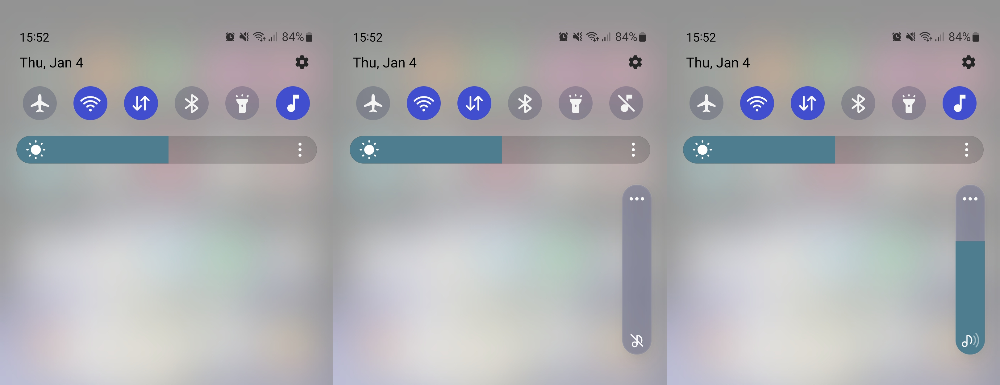

QuickMediaMute
==============

an Android quick settings toggle to mute/unmute media audio.

my phone lives constantly in "vibrate" mode and i like the fact that we have two
separate volumes for ringer and media audio, but i wasn't able to find a quick
setting toggle for switching on and off the media audio (like the one we have
for changing ringer mode between mute, vibrate and sound). this "app" adds just
that: a toggle for the media audio which i find very useful when visiting
certain sites or using certain apps.

yes i could just use the volume up and down keys, but i find that a bit clunky
and when i want to unmute the audio, the previous volumes level is *lost*.

install
-------

just grab the latest `.apk` from the releases page and install it on your phone.

i'm not an "Android developer", so i won't bother putting this thing on the
playstore (this was in fact my first Android "app").

otherwise you can build the `.apk` yourself if you don't trust me :)

thanks
------

to this [random stackoverflow question][30] (and linked tutorials) which pointed
me to the Android Quick Settings API.

[30]: https://stackoverflow.com/questions/66367393/android-how-to-add-a-toggle-button-in-the-notification-panel-the-place-wh

---

see [license file][40] for copyright and license details.

[40]: license
